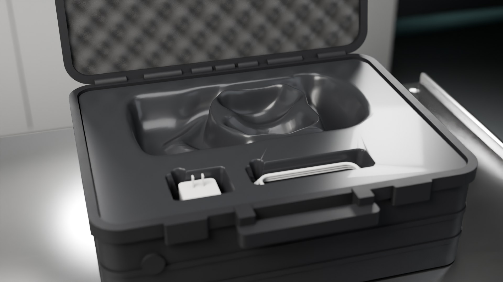
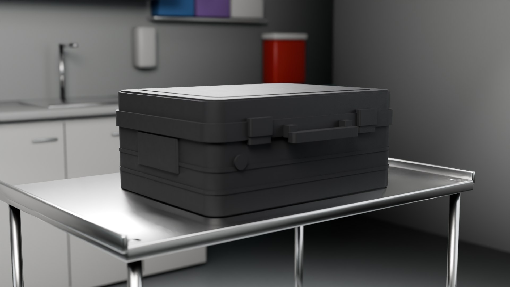
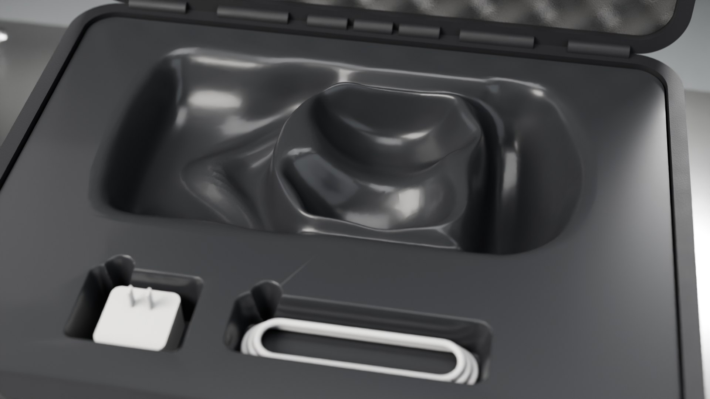

# Sanitizable Case for VR Equipment

A wipe-clean insert for carrying a VR headset in a hospital. The foam in a standard Pelican 1550 case is replaced with one seamless, vacuum-formed PETG/HIPS tray (about 1.5 mm) with a shaped recess for the headset, controllers, charger and cable. Foam can't be disinfected; the formed tray can be wiped clean in a single pass.

Developed and tested with clinical users and used by doctors at the University of Kentucky hospital.

Project page: https://siatohi80.github.io/vr-case-study/ (case-opening animation coming soon)

| | |
|---|---|
|  |  |

- Two-page portfolio sheet: [VR_Case_Portfolio.pdf](media/VR_Case_Portfolio.pdf)

## Project record

University of Kentucky Invention Report 2770, "Sanitizable Case for VR Equipment" (2023), Office of Technology Commercialization / Intellectual Property Development.
Team: D. Strakovsky, S. Tohidi, A. Glueck, L. Jubina, A. Kalema, P. Masterson, K. Mayer, A. Montgomery-Yates.

Renders made in Blender (Cycles).
